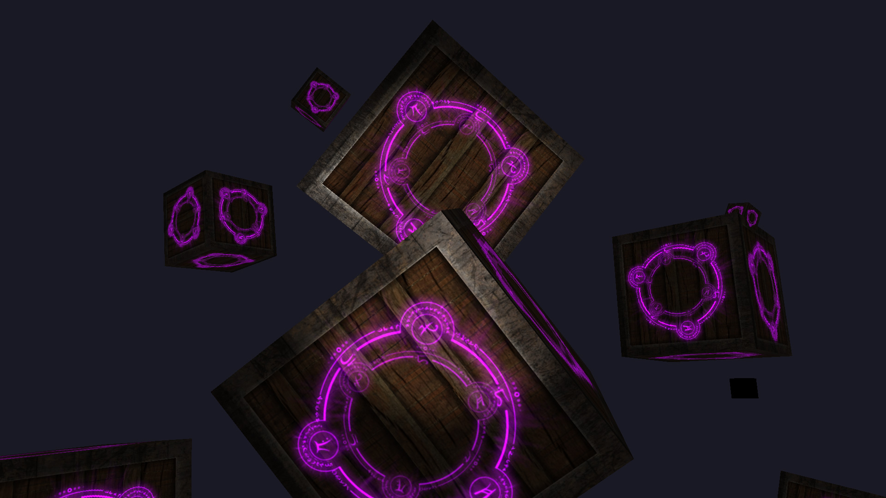
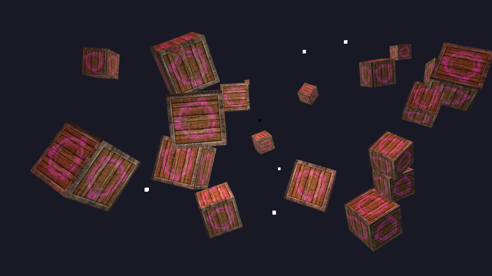
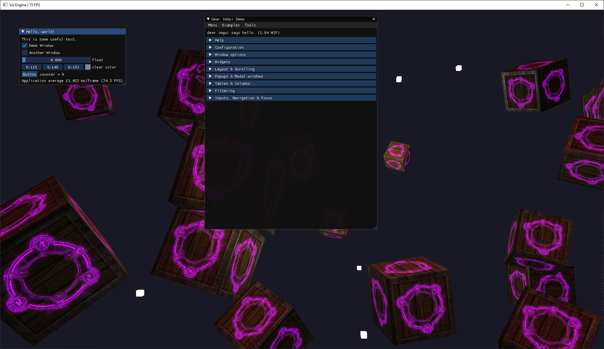

+++
title = "3D Game Engine Devlog, Part 4: Multiple Lights"
slug = "3d-game-engine-devlog-part-4-multiple-lights"
summary = "Light types and multiple light support"
date = "2021-07-12"
tags = ["devlog", "cpp", "game-engine", "ecs", "opengl"]
image = "/images/post-headers/building-game-engine-generic.png"
+++

Last time, I finished off with a scene of floating crates demonstrating some simple diffuse, specular, and emission maps with the help of a very basic point light implementation. With that, I had two main goals in mind:

- Figure out how to support multiple sources of light at once.
- Implement more types of light source.

The next LearnOpenGL chapters on lighting—[Light casters](https://learnopengl.com/Lighting/Light-casters) and [Multiple lights](https://learnopengl.com/Lighting/Multiple-lights)—covered both of those goals nicely, so I continued following them and worked to integrate the results (something which is becoming increasingly challenging as the GL-related parts of the engine codebase diverge more and more from the LearnOpenGL examples!).

---

### Light types

First up was the directional light. This type of light mimics distant light sources (e.g. sunlight) by casting light on the whole scene from a given angle; unlike other lights, directional lights don't have positions.

They do have three properties in common with other lights—i.e. ambient, diffuse, and specular colours—but I opted to create a separate struct for each light. `DirectionalLight` looks like this:


struct DirectionalLight
{
    glm::vec3 direction;
    glm::vec3 ambient;
    glm::vec3 diffuse;
    glm::vec3 specular;
};


To get this working in the scene, the first thing I did was create an entity and attach `Transform`, `Mesh`, `Material` and `DirectionalLight` components to it. The first three aren't used by anything, but my `MeshRenderer` system—which is responsible for rendering `Transform`+`Mesh`+`Material` entities—was also where I was temporarily handling lighting updates, so applying those components to the lights was a quick and dirty way of getting them pushed to `MeshRenderer`.

I updated `MeshRenderer` to hold a reference to the directional light's entity ID and pass the light data as uniforms to the shader program:


auto& directionalLight = GetComponent<DirectionalLight>(m_directionalLightId);

for (auto const& id : m_entities)
{
    ...

    m_pMaterialShaderProgram->SetUniform3f("directionalLight.direction", directionalLight.direction);
    m_pMaterialShaderProgram->SetUniform3f("directionalLight.ambient", directionalLight.ambient);
    m_pMaterialShaderProgram->SetUniform3f("directionalLight.diffuse", directionalLight.diffuse);
    m_pMaterialShaderProgram->SetUniform3f("directionalLight.specular", directionalLight.specular);
}


At this point I decided to keep the light I previously implemented, which was essentially a point light (i.e. a light at a specific position emitting in all directions), and see if I could get it working nicely alongside the directional light. My first attempt at this sort of worked, but was definitely not correct! With the data for each light available to the fragment shader, I calculated diffuse and specular factors for each light and factored them into the final diffuse and specular calculations. Take the specular calculations for example:


// Point light specular
vec3 pointLightReflectDir = reflect(-pointLightDir, norm);
float pointLightSpec = pow(max(dot(viewDir, pointLightReflectDir), 0.0), material.shininess);

// Directional light specular
vec3 directionalLightReflectDir = reflect(-directionalLightDir, norm);
float directionalLightSpec = pow(max(dot(viewDir, directionalLightReflectDir), 0.0), material.shininess);

vec3 specularMap = vec3(texture(material.specular, TexCoords));
vec3 specular = (pointLight.specular * pointLightSpec) * (directionalLight.specular * directionalLightSpec) * specularMap;


Here's how it looked (note the black cube, which represents the directional light, and the white one, which represents the original point light):

It kind of worked, but the point light was significantly weaker despite being so close to one of the crates. Instead of handling it this way, what I needed to do instead was calculate the final `ambient + diffuse + specular` per light and add them together (along with the material's emission colour) to get the final fragment colour.

Before moving on to properly implementing multiple light support, I decided to implement spot lights. Sometimes referred to as omnidirectional lights, they emit light in a cone shape from a specific point, with the angle and several other properties affecting the direction and width of the cone, how soft the edges of the light are, and the attenuation curve (which determines how the light's intensity diminishes). Implementations and available parameters seem to vary between engines, but I just followed the example given on LearnOpenGL, starting with some additions to the struct:


struct SpotLight
{
    glm::vec3 ambient;
    glm::vec3 diffuse;
    glm::vec3 specular;

    glm::vec3 direction;
    float innerEdge;
    float outerEdge;
    float constant;
    float linear;
    float quadratic;
};


I wired this up to `MeshRenderer` and the material shader program in the same way as the other lights, then created an entity with a `SpotLight` component:


componentManager.AddComponent(spotLightId, SpotLight{
        .ambient = glm::vec3(0.2f, 0.2f, 0.2f),
        .diffuse = glm::vec3(0.8f, 0.8f, 0.8f),
        .specular = glm::vec3(1.0f, 1.0f, 1.0f),
        .innerEdge = glm::cos(glm::radians(12.5f)),
        .outerEdge = glm::cos(glm::radians(17.5f)),
        .constant = 1.0f,
        .linear = 0.09f,
        .quadratic = 0.032f,
});


I then created a separate `SpotLightDemo` system to "attach" the spot light entity to the camera by syncing the camera's `position` and `front` properties with it:


#include "Entity/Component/Camera.hpp"
#include "Entity/Component/SpotLight.hpp"
#include "Entity/Component/Transform.hpp"
#include "Scene/Scene.hpp"
#include "System/SpotLightDemo.hpp"

using namespace Iris;

std::list<ComponentType> SpotLightDemo::GetComponentTypes()
{
    return {
            GetComponentType<Transform>(),
            GetComponentType<SpotLight>()
    };
}

void SpotLightDemo::SetCameraId(EntityId id)
{
    m_cameraId = id;
}

void SpotLightDemo::Update(Window &window, Scene& scene)
{
    auto sceneEntities = scene.GetEntities();
    auto& camera = GetComponent<Camera>(m_cameraId);

    for (auto const& id : m_entities)
    {
        // TODO: find a better way of limiting the update to the intersection of system and scene entities
        if (sceneEntities.find(id) == sceneEntities.end()) continue;

        auto& transform = GetComponent<Transform>(id);
        transform.position = camera.position;

        auto& spotLight = GetComponent<SpotLight>(id);
        spotLight.direction = camera.front;
    }
}


In order to test it in isolation, I replaced the lighting calculations in the fragment shader with the spot light calculations.

Here's how it looked in-scene:

Good result!

---

### Let there be lights

The first step towards rendering the scene with multiple lights was to modify the fragment shader to accept arrays for spot lights and point lights (not directional lights, since there only needs to be one in existence at any given moment). I set a maximum size for the arrays (since we can't have an infinite number of lights and it's possible to keep the maximum number of active lights below a certain threshold, which I'll explore later) and also added uniforms for specifying the number of active lights for each type:


#define MAX_POINT_LIGHTS 20
#define MAX_SPOT_LIGHTS 20

uniform int pointLightCount;
uniform int spotLightCount;

uniform DirectionalLight directionalLight;
uniform PointLight pointLights[MAX_POINT_LIGHTS];
uniform SpotLight spotLights[MAX_SPOT_LIGHTS];


I then defined functions to take care of lighting calculations, similar to the examples given on LearnOpenGL. Here are their prototypes:


vec3 CalcDirectionalLight(DirectionalLight light, vec3 normal, vec3 viewDirection);
vec3 CalcPointLight(PointLight light, vec3 normal, vec3 viewDirection);
vec3 CalcSpotLight(SpotLight light, vec3 normal, vec3 viewDirection);
float CalcLightDiffuseFactor(vec3 normal, vec3 lightDirection);
float CalcLightSpecularFactor(vec3 normal, vec3 lightDirection, vec3 viewDirection);
vec3 Sample(sampler2D sampler);


With these in place, I could simply start with a fragment colour (black) and add the result of each light calculation to it:


vec3 normal = normalize(Normal);
vec3 viewDirection = normalize(viewPosition - FragPos);

vec3 color = vec3(0.0);
color += CalcDirectionalLight(directionalLight, normal, viewDirection);

for (int i = 0; i < pointLightCount; i++)
{
    color += CalcPointLight(pointLights[i], normal, viewDirection);
}

for (int i = 0; i < spotLightCount; i++)
{
    color += CalcSpotLight(spotLights[i], normal, viewDirection);
}

vec3 emissionMap = Sample(material.emission);
color += emissionMap * (sin(time) * 0.5f + 0.5f) * 2.0;

FragColor = vec4(color, 1.0);


During the process of getting this to work, I ran into issues figuring out the correct calculations in screen space, so I moved back to doing shader calculations in world space—which requires providing the camera position to the fragment shader-to get it working. When I understand the maths better, I'll come back to this to see if I can get it working in screen space.

At this point, I also realised that `MeshRenderer` was simply getting too cumbersome and doing too much work, so I turned my existing `PointLightDemo` and `SpotLightDemo` systems into `PointLightController` and `SpotLightController` respectively, moving all of the lighting data updates into them and removing that burden from `MeshRenderer`. This was a much cleaner arrangement, with a total of four systems registered:


App& app = App::GetInstance();
app.RegisterUpdateSystem(cameraController);
app.RegisterPreRenderSystem(pointLightController);
app.RegisterPreRenderSystem(spotLightController);
app.RegisterRenderSystem(meshRenderer);


However, it presented one problem; both of the light controllers required access to the same shader program as `MeshRenderer`, i.e. the `Material` shader program, which was until this point being instantiated in `MeshRenderer`'s constructor. I had a few solutions in mind for this, but ultimately decided to expand my asset management with a `ShaderProgramRepository` (on the basis that shader programs are built from GLSL source files read from disk), which enabled systems (or anything else) to obtain the same instance of a shader program via `AssetManager`:


AssetManager& assetManager = AssetManager::GetInstance();
auto basicShaderProgram = assetManager.GetShaderProgram("Basic");
auto materialShaderProgram = assetManager.GetShaderProgram("Material");


Problem solved! After some tweaking of the light data and number of lights, here's how the scene looked:

One directional light, numberous point lights, and a spot light attached to the camera (although it's not very noticeable here).

---

### Bonus: GUI integration

Having a scene full of lights with various properties is nice, but changing those properties in code and recompiling every time I want to test or verify something was starting to get cumbersome, so I decided to integrate a GUI library to make things easier. There are lots of GUI options for C++, but I was quick to opt for the popular [Dear ImGui](https://github.com/ocornut/imgui)—an [immediate mode GUI](https://en.wikipedia.org/wiki/Immediate_mode_GUI) library used in many game projects to provide debug UIs or interfaces for in-house tools. It's sponsored by some big names such as Blizzard and Ubisoft, and often shows up in behind-the-scenes footage at GDC talks, so I knew it would easily meet my criteria.

I started by grabbing the ImGui headers and source files and updating my CMake config to pull them in. This alone took some trial and error as I realised I forgot a few headers and had to enable imm32, among other things. However, it didn't take long to get a very basic integration of the ImGui demo working, which entailed calling a series of `ImGui::*` functions for initialisation, frame preparation at the start of the main loop, drawing various elements, rendering the collected draw data (just before the frame buffers are swapped), and cleaning up after the main loop.

Here's how the integration looked:

I was happy with that progress, but before I could make any real use of it, I wanted to clean up the integration and make it more manageable. I spent a while thinking about this, at one point peeking at [TheCherno's Hazel engine](https://github.com/TheCherno/Hazel) (which uses Dear ImGui for its editor interface), and eventually settled on a basic concept consisting of two components:

- `ImGuiLayer`: a container for ImGui elements, responsible for the whole lifecycle of preparing and drawing them. Wraps `ImGui::*` lifecycle calls.
- `ImGuiPanel`: a simple interface for implementing ImGui windows (which I opted to refer to as panels to avoid confusion with windows in the OS/GLFW sense). These can be attached to an `ImGuiLayer` instance.

I expanded `State`—which was so far only responsible for pairing window instances with scene instances—to include an `ImGuiLayer` instance. I then expanded `App` to include an `m_debug` flag (toggleable with the 'H' key) and make the necessary calls to the `ImGuiLayer` instances throughout the main loop, which looks like this:


void App::Run(const std::list<std::unique_ptr<State>>& states) const
{
    while (!m_shouldExit)
    {
        glfwPollEvents();

        for (auto const &state : states)
        {
            auto &window = state->GetWindow();
            auto &scene = state->GetScene();
            auto &imGuiLayer = state->GetImGuiLayer();

            if (m_debug) imGuiLayer.PrepareNewFrame();

            window.MakeCurrent();
            window.EnableVsync();

            window.Tick();

            if (window.ShouldUpdateFPS())
            {
                auto title = fmt::format("{} | {} FPS", window.GetTitle(), window.GetFrameCount());
                window.SetTitle(title.c_str());
                window.ResetFPSState();
            }

            while (window.ShouldUpdate())
            {
                for (const auto &system : m_updateSystems) system->Update(window, m_debug);
                window.OnUpdated();
            }

            if (m_debug) imGuiLayer.PrepareRender();

            Renderer::Clear(scene.GetClearColor());

            for (const auto &system : m_preRenderSystems) system->Update(window, scene, m_debug);
            for (const auto &system : m_renderSystems) system->Update(window, scene, m_debug);

            if (m_debug) imGuiLayer.Render();

            window.SwapBuffers();
            for (const auto &system : m_postRenderSystems) system->Update(window, scene, m_debug);
        }
    }
}


With that groundwork in place, I created two `ImGuiPanel` implementations. The first, `InfoPanel`, displays frame time, FPS, and some details about the camera. The second, `PointLightControlPanel`, exposes a list of point lights by their entity IDs, allowing them to be selected and their `Transform`/`PointLight` properties to be edited in real time.

Once the panels were attached to the layer, all that was left to do was play with it:



Much better!

---

This post reflects my biggest chunk of progress on the engine so far, and while working on it, I inevitably thought of more things to add to the To Do list. I'll likely work on a few of those things next, or I might just push on to the next LearnOpenGL chapter, [Model Loading](https://learnopengl.com/Model-Loading/Assimp)—so I can finally look at (and show off) something other than crates with glowing arcane symbols on them!

---

*The latest code for this project can be found at [https://github.com/Riari/iris-engine](https://github.com/Riari/iris-engine).*