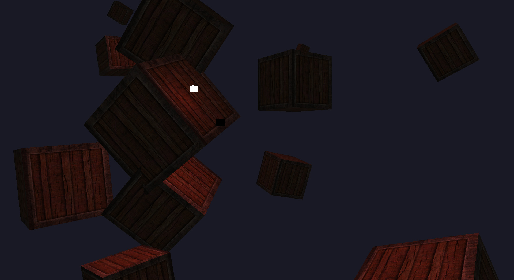

+++
title = "3D Game Engine Devlog, Part 4: Multiple Lights"
slug = "3d-game-engine-devlog-part-4-multiple-lights"
summary = "Light types and multiple light support"
date = "2021-07-03"
tags = ["devlog", "cpp", "game-engine", "ecs", "opengl"]
image = "/images/post-headers/building-game-engine-generic.png"
+++

Last time, I finished off with a scene of floating crates demonstrating some simple diffuse, specular, and emission maps with the help of a very basic point light implementation. With that, I had two main goals in mind:

- Figure out how to support multiple sources of light at once.
- Implement more types of light source.

The next LearnOpenGL chapters on lighting—[Light casters](https://learnopengl.com/Lighting/Light-casters) and [Multiple lights](https://learnopengl.com/Lighting/Multiple-lights)—covered both of those goals nicely, so I continued following them and worked to integrate the results (something which is becoming increasingly challenging as the GL-related parts of the engine codebase diverge more and more from the LearnOpenGL examples!).

---

### Light types

First up was the directional light. This type of light mimics distant light sources (e.g. sunlight) by casting light on the whole scene from a given angle; unlike other lights, directional lights don't have positions.

They do have three properties in common with other lights—i.e. ambient, diffuse, and specular colours—but I opted to create a separate struct for each light. `DirectionalLight` looks like this:


struct DirectionalLight
{
    glm::vec3 direction;
    glm::vec3 ambient;
    glm::vec3 diffuse;
    glm::vec3 specular;
};


To get this working in the scene, the first thing I did was create an entity and attach `Transform`, `Mesh`, `Material` and `DirectionalLight` components to it. The first three aren't used by anything, but my `MeshRenderer` system—which is responsible for rendering `Transform`+`Mesh`+`Material` entities—was also where I was temporarily handling lighting updates, so applying those components to the lights was a quick and dirty way of getting them pushed to `MeshRenderer`.

I updated `MeshRenderer` to hold a reference to the directional light's entity ID and pass the light data as uniforms to the shader program:


auto& directionalLight = GetComponent<DirectionalLight>(m_directionalLightId);

for (auto const& id : m_entities)
{
    ...

    m_pMaterialShaderProgram->SetUniform3f("directionalLight.direction", directionalLight.direction);
    m_pMaterialShaderProgram->SetUniform3f("directionalLight.ambient", directionalLight.ambient);
    m_pMaterialShaderProgram->SetUniform3f("directionalLight.diffuse", directionalLight.diffuse);
    m_pMaterialShaderProgram->SetUniform3f("directionalLight.specular", directionalLight.specular);
}


At this point I decided to keep the light I previously implemented, which was essentially a point light (i.e. a light at a specific position emitting in all directions), and see if I could get it working nicely alongside the directional light. My first attempt at this sort of worked, but was definitely not correct! With the data for each light available to the fragment shader, I calculated diffuse and specular factors for each light and factored them into the final diffuse and specular calculations. Take the specular calculations for example:


// Point light specular
vec3 pointLightReflectDir = reflect(-pointLightDir, norm);
float pointLightSpec = pow(max(dot(viewDir, pointLightReflectDir), 0.0), material.shininess);

// Directional light specular
vec3 directionalLightReflectDir = reflect(-directionalLightDir, norm);
float directionalLightSpec = pow(max(dot(viewDir, directionalLightReflectDir), 0.0), material.shininess);

vec3 specularMap = vec3(texture(material.specular, TexCoords));
vec3 specular = (pointLight.specular * pointLightSpec) * (directionalLight.specular * directionalLightSpec) * specularMap;


Here's how it looked (note the black cube, which represents the directional light, and the white one, which represents the original point light):

It kind of worked, but the point light was significantly weaker despite being so close to one of the crates. Instead of handling it this way, what I needed to do instead was calculate the final `ambient + diffuse + specular` per light and add them together (along with the material's emission colour) to get the final fragment colour.

Before I moved on to properly implementing multiple light support, I decided to implement spot lights next. Spot lights—sometimes referred to as omnidirectional lights—emit light in a cone shape from a specific point, with the angle and several other properties affecting the direction and width of the cone, how soft the edges of the light are, and the attenuation curve (which determines how the light's intensity diminishes).

- Spot light implementation
- Adding support for multiple light instances
- Briefly mention splitting shader program creation/retrieval out to an asset repository implementation

---

### Bonus: GUI integration

Having a scene full of entities with various properties is nice, but changing those properties in code and recompiling every time I want to test or verify something was starting to get cumbersome, so I decided to integrate a GUI library to make things easier. There are lots of GUI options for C++, but I was quick to opt for the popular [Dear ImGui](https://github.com/ocornut/imgui) - an [immediate mode GUI](https://en.wikipedia.org/wiki/Immediate_mode_GUI) library used in many game projects to provide debug UIs or interfaces for in-house tools. It's sponsored by some big names such as Blizzard and Ubisoft, and often shows up in behind-the-scenes footage at GDC talks, so I knew it would easily meet my criteria.